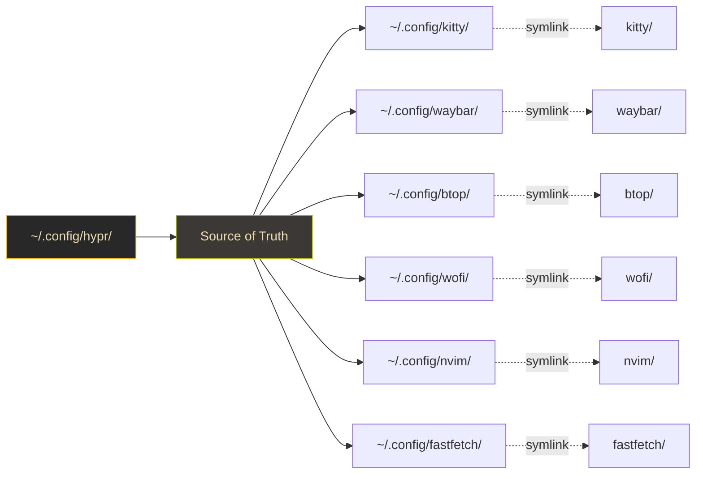
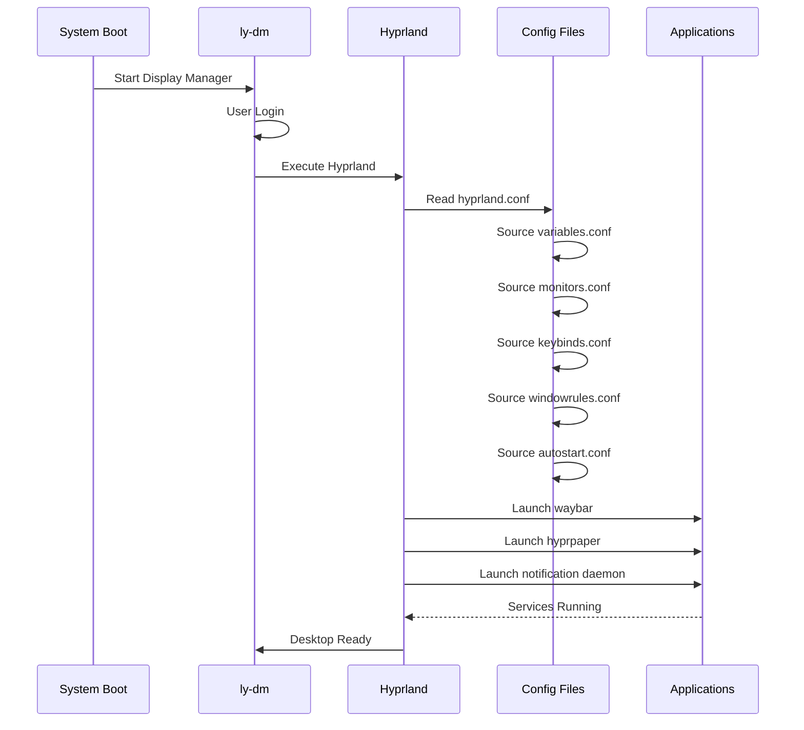
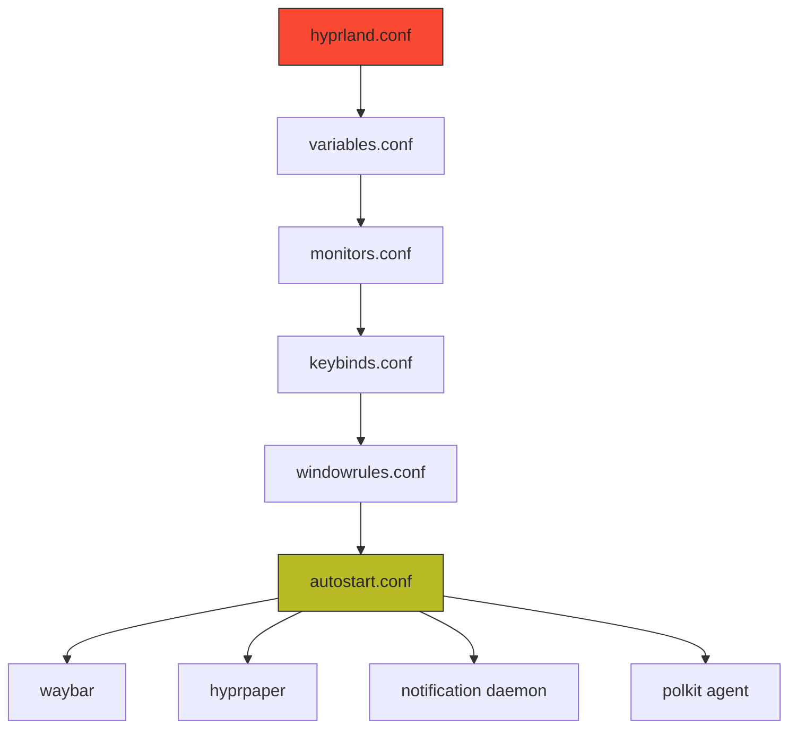
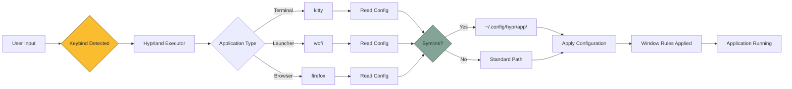
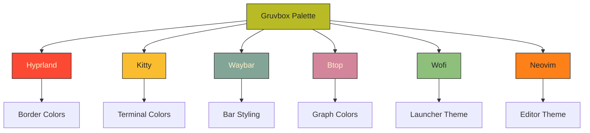

# Hyprland Dotfiles Configuration

A clean, modular Wayland desktop environment built on Hyprland with unified Gruvbox theming and centralized configuration management.

> Current configuration note: Hyprland 0.56 uses `hyprland.lua` and the modules in
> `config/`. Older `.conf` source-chain examples later in this document are historical
> reference material and are not the active entrypoint. `hypridle.conf` and
> `hyprlock.conf` remain daemon-specific configs; no `hyprland.conf` or `hyprpaper.conf`
> is used.

## Table of Contents

1. [Overview](#overview)
2. [Recent Changes](#recent-changes)
3. [Directory Structure](#directory-structure)
4. [System Architecture](#system-architecture)
5. [Configuration Components](#configuration-components)
6. [Installation](#installation)
7. [Theme System](#theme-system)
8. [Keybindings](#keybindings)
9. [Troubleshooting](#troubleshooting)
10. [Maintenance](#maintenance)

---

## Overview

### System Specifications

**Compositor**: Hyprland (Wayland)  
**Terminal**: Kitty  
**Bar**: Waybar  
**Launcher**: Wofi  
**Theme**: Gruvbox Dark Hard  
**Display Manager**: ly-dm  
**Configuration Management**: Git + Symlinks

### Design Philosophy

This configuration follows a single-source-of-truth approach where all configurations reside in `~/.config/hypr/` and are accessed through symbolic links. This ensures:

- Centralized version control
- Easy backup and restoration
- Consistent theming across applications
- Portable configuration across machines

---

## Recent Changes

### Hybrid GPU, Power/Fan Controls, Dashboard & Theme Consistency

**GPU (HP Victus — Intel iGPU + NVIDIA RTX 3050)**

- New `env.conf` (sourced first) sets `AQ_DRM_DEVICES` to render Hyprland on the
  NVIDIA dGPU, plus Wayland-native toolkit env vars
- Qt theming enabled safely via `QT_QPA_PLATFORMTHEME=qt6ct` (Kvantum Gruvbox).
  Note: `QT_STYLE_OVERRIDE=kvantum` is intentionally avoided — it core-dumps KDE
  apps (systemsettings) with kvantum 1.1.8 + Qt 6.11

**Power & fan controls** (`scripts/`)

- `SUPER+SHIFT+P` — toggle ACPI platform profile balanced ↔ performance
  (via `power-profiles-daemon` over D-Bus, no sudo)
- `SUPER+SHIFT+F` — fans MAX ↔ auto for cooling/dust-cleaning (via `nbfc`)
- Both have live waybar indicators (power profile always shown; fan-max blinks
  red only when forced)

**Quickshell dashboard** (`SUPER+D`)

- New `quickshell/modules/dashboard/` — a movable floating window with clock,
  now-playing (playerctl), CPU/RAM/TEMP/BATT/DISK/UPTIME stats, quick toggles
  (wifi/bt/profile/fan/lock/logout) and volume/brightness sliders
- Reuses the `scripts/` helpers; Gruvbox-themed, self-contained

**Theme consistency — Gruvbox Dark Hard everywhere**

- Unified GTK (Gruvbox-Retro), cursor (Gruvbox-Retro), Qt icons
  (Gruvbox-Plus-Dark), Kvantum (opaque Gruvbox), and a new inline Gruvbox
  `yazi/theme.toml`. Fixed gsettings/qtct/kvantum mismatches

**Repo structure**

- Flattened `waybar` (was a broken phantom submodule) and `wofi` (was a vendored
  embedded clone) into the single repo so all configs are tracked normally
- `yazi/` and `Kvantum/` migrated into the repo and symlinked from `~/.config`

### Configuration Cleanup

**Hyprland Config Consolidation**

- Merged 4 duplicate `general {}` blocks into single clean configuration
- Consolidated 3 `decoration {}` blocks into unified block
- Fixed deprecated syntax: `animations { enabled = yes, please :) }` to `enabled = true`
- Migrated from `windowrule` v1 to `windowrulev2` syntax
- Added battery optimization: `misc { vfr = true }`
- Enhanced window interaction: `resize_on_border = true` with `extend_border_grab_area = 15`
- Added visual enhancements: `dim_inactive` with configurable `dim_strength`

**Scripts Created**

- `hypr_consolidate.sh` - Automated config cleanup and single-block writer
- `hypr_symlink.sh` - Symlink creation automation
- `kitty_warm.sh` - Kitty theme warming script
- `waybar_fix.sh` - Waybar syntax and module fixes
- `keybinds_fix.sh` - Keybinding conflict resolution

### Symlink Structure

Established `~/.config/hypr/` as configuration source with symlinks for:

- kitty
- waybar
- btop
- wofi
- nvim
- fastfetch

Verification: `ls -la ~/.config/ | grep '\->'`

### Theme Unification - Gruvbox Dark

**Kitty Terminal**

- Converted from Catppuccin Mocha to Gruvbox Dark
- Warmed background: `#282828` to `#1c1917`
- Updated cursor color: `#fabd2f`
- Updated URL color: `#fe8019`

**Waybar**

- Fixed deprecated syntax errors
- Added battery module with state indicators (charging/warning/critical)
- Optimized dimensions: height `35px` to `28px`
- Improved spacing with proper margins
- Reduced module padding for cleaner appearance
- Applied Gruvbox Elongated theme with transparent modules

**Btop**

- Added Gruvbox theme variants (soft, standard, zsh-compatible)

### Keybinding Updates

**Fixed Conflicts**

- Changed resize bindings: `bind` to `binde` for hold-to-repeat
- Removed `SUPER+R` conflict (hyprctl reload vs wofi)
- Removed `SUPER+N` conflict (wifi menu vs swaync)

**New Bindings**

- Added fine resize: `SUPER+ALT+HJKL` (10px increments)
- Improved window management shortcuts

---

## Directory Structure

```
~/.config/hypr/
├── hyprland.lua               # Hyprland 0.56+ entry point
├── init.lua                    # Module loader and shared commands
├── config/                     # Lua compositor modules
│   ├── environment.lua
│   ├── monitors.lua
│   ├── autostart.lua
│   ├── appearance.lua
│   ├── keybinds.lua
│   └── rules.lua
├── readme.md                  # This file
│
├── battery-notify/
│   └── battery_notify.sh      # Battery notification script
│
├── btop/
│   ├── btop.conf              # System monitor config
│   ├── btop.conf.bak          # Backup
│   └── themes/
│       ├── gruvbox-soft.theme
│       ├── gruvbox.theme
│       └── gruvbox-zsh.theme
│
├── fastfetch/
│   └── config.jsonc           # System info display
│
├── kitty/
│   ├── kitty.conf             # Terminal config
│   ├── kitty.conf.bak         # Backup
│   ├── style.conf             # Gruvbox styling
│   ├── current-theme.conf     # Active theme
│   └── current-theme1.conf    # Theme variant
│
├── nvim/
│   ├── init.lua               # Neovim entry point
│   ├── lazy-lock.json         # Plugin lock file
│   └── lua/
│       ├── configs/           # Plugin configurations
│       ├── custom/            # Custom modules
│       ├── plugins/           # Plugin definitions
│       ├── cheatsheet/        # Cheatsheet configs
│       ├── autocmds.lua       # Auto commands
│       ├── chadrc.lua         # NvChad config
│       ├── mappings.lua       # Keymaps
│       └── options.lua        # Editor options
│
├── themes/                    # Empty - centralized themes in apps
│
├── waybar/
│   ├── config                 # Module configuration
│   ├── style.css              # Gruvbox elongated styling
│   └── bak_*/                 # Timestamped backups
│
├── wlogout/
│   ├── layout_1, layout_2     # Menu layouts
│   ├── style_1.css, style_2.css
│   └── icons/                 # Power menu icons
│
└── wofi/
    ├── config/config          # Launcher settings
    ├── style.css              # Main styling
    ├── colors.css             # Color definitions
    ├── src/                   # Theme sources
    │   ├── gruvbox/
    │   ├── mocha/
    │   ├── frappe/
    │   ├── latte/
    │   └── macchiato/
    └── assets/                # Theme previews
```

### Symbolic Link Map



---

## System Architecture

### Boot to Desktop Flow



### Configuration Loading Order



### Application Launch Flow



---

## Configuration Components

### Hyprland Core Files

#### hyprland.conf

Main configuration entry point that sources all modular configs.

**Key Sections**:

```conf
# Source modular configurations
source = ~/.config/hypr/variables.conf
source = ~/.config/hypr/monitors.conf
source = ~/.config/hypr/keybinds.conf
source = ~/.config/hypr/windowrules.conf
source = ~/.config/hypr/autostart.conf

# General settings (consolidated)
general {
    gaps_in = 5
    gaps_out = 10
    border_size = 2
    col.active_border = rgb(b8bb26)
    col.inactive_border = rgb(3c3836)
    layout = dwindle
    resize_on_border = true
    extend_border_grab_area = 15
}

# Decoration (consolidated)
decoration {
    rounding = 8
    active_opacity = 1.0
    inactive_opacity = 0.9
    drop_shadow = true
    shadow_range = 4
    shadow_render_power = 3
    col.shadow = rgba(1a1a1aee)
    dim_inactive = true
    dim_strength = 0.2
}

# Animations (fixed syntax)
animations {
    enabled = true
    bezier = myBezier, 0.05, 0.9, 0.1, 1.05
    animation = windows, 1, 7, myBezier
    animation = windowsOut, 1, 7, default, popin 80%
    animation = border, 1, 10, default
    animation = fade, 1, 7, default
    animation = workspaces, 1, 6, default
}

# Misc optimizations
misc {
    vfr = true
    disable_hyprland_logo = true
    disable_splash_rendering = true
}
```

#### variables.conf

Environment variables and global settings.

```conf
# GTK Theme
env = GTK_THEME,Gruvbox-Dark

# Qt Theme
env = QT_QPA_PLATFORMTHEME,qt5ct
env = QT_STYLE_OVERRIDE,kvantum

# Cursor Theme
env = XCURSOR_THEME,Adwaita
env = XCURSOR_SIZE,24

# Default Applications
env = TERMINAL,kitty
env = BROWSER,firefox
env = EDITOR,nvim

# Wayland Environment
env = XDG_CURRENT_DESKTOP,Hyprland
env = XDG_SESSION_TYPE,wayland
env = XDG_SESSION_DESKTOP,Hyprland

# Graphics
env = GBM_BACKEND,nvidia-drm
env = __GLX_VENDOR_LIBRARY_NAME,nvidia
env = WLR_NO_HARDWARE_CURSORS,1
```

#### monitors.conf

Display configuration.

```conf
# Laptop display
monitor = eDP-1, 1920x1080@60, 0x0, 1.0

# External monitor (if connected)
monitor = HDMI-A-1, 1920x1080@60, 1920x0, 1.0

# Fallback for unknown monitors
monitor = , preferred, auto, 1.0
```

#### keybinds.conf

Keyboard shortcuts (conflicts resolved).

**Window Management**:

```conf
# Focus
bind = SUPER, H, movefocus, l
bind = SUPER, L, movefocus, r
bind = SUPER, K, movefocus, u
bind = SUPER, J, movefocus, d

# Move windows
bind = SUPER SHIFT, H, movewindow, l
bind = SUPER SHIFT, L, movewindow, r
bind = SUPER SHIFT, K, movewindow, u
bind = SUPER SHIFT, J, movewindow, d

# Resize (fixed: bind -> binde for repeat)
binde = SUPER CTRL, H, resizeactive, -40 0
binde = SUPER CTRL, L, resizeactive, 40 0
binde = SUPER CTRL, K, resizeactive, 0 -40
binde = SUPER CTRL, J, resizeactive, 0 40

# Fine resize (new)
binde = SUPER ALT, H, resizeactive, -10 0
binde = SUPER ALT, L, resizeactive, 10 0
binde = SUPER ALT, K, resizeactive, 0 -10
binde = SUPER ALT, J, resizeactive, 0 10
```

**Application Launchers**:

```conf
# Terminal
bind = SUPER, RETURN, exec, kitty

# Application launcher (conflict resolved: removed R for reload)
bind = SUPER, D, exec, wofi --show drun

# Browser
bind = SUPER, B, exec, firefox

# File manager
bind = SUPER, E, exec, thunar
```

**System Controls**:

```conf
# Close window
bind = SUPER, Q, killactive

# Exit Hyprland
bind = SUPER SHIFT, M, exit

# Lock screen
bind = SUPER, ESCAPE, exec, hyprlock

# Logout menu
bind = SUPER SHIFT, ESCAPE, exec, wlogout

# Screenshot
bind = , PRINT, exec, grim -g "$(slurp)" - | wl-copy
bind = SHIFT, PRINT, exec, grim - | wl-copy
```

#### windowrules.conf

Window-specific behavior (migrated to v2 syntax).

```conf
# Float specific windows
windowrulev2 = float, class:^(pavucontrol)$
windowrulev2 = float, class:^(blueman-manager)$
windowrulev2 = float, class:^(nm-connection-editor)$

# Workspace assignments
windowrulev2 = workspace 2, class:^(firefox)$
windowrulev2 = workspace 3, class:^(Code)$
windowrulev2 = workspace 4, class:^(spotify)$

# Opacity rules
windowrulev2 = opacity 0.95 0.85, class:^(kitty)$
windowrulev2 = opacity 1.0 1.0, class:^(firefox)$

# Size rules
windowrulev2 = size 800 600, class:^(pavucontrol)$
windowrulev2 = center, class:^(pavucontrol)$
```

#### autostart.conf

Services launched at startup.

```conf
# Status bar
exec-once = waybar &

# Wallpaper
exec-once = hyprpaper &

# Notification daemon (if using swaync)
exec-once = swaync &

# Authentication agent
exec-once = /usr/lib/polkit-gnome/polkit-gnome-authentication-agent-1 &

# Network manager applet
exec-once = nm-applet --indicator &

# Battery notifications
exec-once = ~/.config/hypr/battery-notify/battery_notify.sh &
```

---

## Theme System

### Gruvbox Color Palette

#### Base Colors

```css
/* Dark Hard Variant */
@define-color bg0_hard    #1d2021;  /* Darkest background */
@define-color bg0         #282828;  /* Normal background */
@define-color bg1         #3c3836;  /* Elevated surfaces */
@define-color bg2         #504945;  /* Higher elevation */
@define-color bg3         #665c54;  /* Borders */

/* Foreground */
@define-color fg0         #fbf1c7;  /* Brightest text */
@define-color fg1         #ebdbb2;  /* Primary text */
@define-color fg2         #d5c4a1;  /* Secondary text */
@define-color fg3         #bdae93;  /* Tertiary text */
```

#### Accent Colors

```css
/* Primary Accents */
@define-color red         #fb4934;  /* Errors, urgent */
@define-color green       #b8bb26;  /* Success, active */
@define-color yellow      #fabd2f;  /* Warnings, highlights */
@define-color blue        #83a598;  /* Info, links */
@define-color purple      #d3869b;  /* Special elements */
@define-color aqua        #8ec07c;  /* Secondary highlights */
@define-color orange      #fe8019;  /* Accent elements */

/* Dimmed Variants */
@define-color red_dim     #cc2412;
@define-color green_dim   #98971a;
@define-color yellow_dim  #d79921;
@define-color blue_dim    #458588;
@define-color purple_dim  #b16286;
@define-color aqua_dim    #689d6a;
@define-color orange_dim  #d65d0e;
```

### Application-Specific Theming



### Kitty Terminal Theme

**File**: `kitty/style.conf`

```conf
# Background and Foreground
background #1c1917
foreground #ebdbb2

# Cursor
cursor #fabd2f
cursor_text_color #282828

# Selection
selection_foreground #282828
selection_background #fabd2f

# URL Color
url_color #fe8019

# Black
color0  #282828
color8  #928374

# Red
color1  #fb4934
color9  #fb4934

# Green
color2  #b8bb26
color10 #b8bb26

# Yellow
color3  #fabd2f
color11 #fabd2f

# Blue
color4  #83a598
color12 #83a598

# Magenta
color5  #d3869b
color13 #d3869b

# Cyan
color6  #8ec07c
color14 #8ec07c

# White
color7  #ebdbb2
color15 #fbf1c7
```

### Waybar Theme

**File**: `waybar/style.css`

```css
* {
  font-family: "Maple Mono NF", "JetBrains Mono Nerd Font", monospace;
  font-size: 13px;
  font-weight: 500;
  min-height: 0;
}

#waybar {
  background: transparent;
  color: #ebdbb2;
  margin: 8px 16px;
}

#workspaces button {
  color: #fabd2f;
  background: rgba(60, 56, 54, 0.85);
  padding: 0.5rem 1.2rem;
  margin: 2px 3px;
  border-radius: 6px;
}

#workspaces button.active {
  color: #b8bb26;
  background: #3c3836;
  font-weight: 600;
}

#clock {
  color: #83a598;
  background: rgba(60, 56, 54, 0.85);
  padding: 0.6rem 2rem;
  border-radius: 8px;
}

#battery {
  color: #b8bb26;
}

#battery.charging {
  color: #8ec07c;
}

#battery.warning:not(.charging) {
  color: #fabd2f;
}

#battery.critical:not(.charging) {
  color: #fb4934;
}
```

---

## Installation

### Prerequisites

**Required Packages** (Arch Linux):

```bash
sudo pacman -S hyprland waybar kitty wofi ly polkit-gnome \
               network-manager-applet fastfetch btop neovim \
               grim slurp wl-clipboard hyprpaper
```

**AUR Packages**:

```bash
yay -S hyprlock-git
```

### Setup Process

#### Step 1: Clone Repository

```bash
# Backup existing configs if any
mv ~/.config/hypr ~/.config/hypr.bak

# Clone this repository
cd ~/.config
git clone <your-repo-url> hypr
cd hypr
```

#### Step 2: Create Symlinks

**Automated Method**:

```bash
# Use the provided script
bash hypr_symlink.sh
```

**Manual Method**:

```bash
# Remove existing configs
rm -rf ~/.config/kitty
rm -rf ~/.config/waybar
rm -rf ~/.config/btop
rm -rf ~/.config/wofi
rm -rf ~/.config/nvim
rm -rf ~/.config/fastfetch

# Create symlinks
ln -s ~/.config/hypr/kitty ~/.config/kitty
ln -s ~/.config/hypr/waybar ~/.config/waybar
ln -s ~/.config/hypr/btop ~/.config/btop
ln -s ~/.config/hypr/wofi ~/.config/wofi
ln -s ~/.config/hypr/nvim ~/.config/nvim
ln -s ~/.config/hypr/fastfetch ~/.config/fastfetch
```

#### Step 3: Verify Symlinks

```bash
ls -la ~/.config | grep '\->'
```

Expected output shows arrows pointing to `hypr/` subdirectories:

```
kitty -> /home/user/.config/hypr/kitty
waybar -> /home/user/.config/hypr/waybar
btop -> /home/user/.config/hypr/btop
...
```

#### Step 4: Configure Display Manager

```bash
# Enable ly-dm
sudo systemctl enable ly.service
sudo systemctl start ly.service
```

#### Step 5: Set Wallpaper

```bash
# Create wallpaper directory
mkdir -p ~/Pictures/wallpaper

# Copy your wallpaper
cp /path/to/wallpaper.jpg ~/Pictures/wallpaper/

# Edit hyprpaper.conf to point to your wallpaper
```

#### Step 6: First Login

1. Logout of current session
2. At ly-dm, select Hyprland
3. Login with credentials
4. Desktop should load with all configurations applied

### Post-Installation

**Verify Services**:

```bash
# Check Waybar
ps aux | grep waybar

# Check wallpaper daemon
ps aux | grep hyprpaper

# Check all Hyprland processes
hyprctl clients
```

**Test Keybindings**:

- `SUPER + RETURN` - Open terminal
- `SUPER + D` - Launch application menu
- `SUPER + Q` - Close window
- `SUPER + 1-9` - Switch workspaces

---

## Keybindings

### Quick Reference

#### Window Management

| Keybind | Action |
|---------|--------|
| `SUPER + H/J/K/L` | Focus window (vim-style) |
| `SUPER + SHIFT + H/J/K/L` | Move window |
| `SUPER + CTRL + H/J/K/L` | Resize window (40px) |
| `SUPER + ALT + H/J/K/L` | Fine resize (10px) |
| `SUPER + Q` | Close window |
| `SUPER + V` | Toggle floating |
| `SUPER + F` | Toggle fullscreen |
| `SUPER + P` | Toggle pseudo-tiling |

#### Workspace Management

| Keybind | Action |
|---------|--------|
| `SUPER + 1-9` | Switch to workspace 1-9 |
| `SUPER + SHIFT + 1-9` | Move window to workspace |
| `SUPER + Mouse Scroll` | Cycle workspaces |
| `SUPER + TAB` | Next workspace |
| `SUPER + SHIFT + TAB` | Previous workspace |

#### Application Launchers

| Keybind | Action |
|---------|--------|
| `SUPER + RETURN` | Terminal (kitty) |
| `SUPER + D` | Application launcher (wofi) |
| `SUPER + B` | Browser (firefox) |
| `SUPER + E` | File manager (thunar) |

#### System Controls

| Keybind | Action |
|---------|--------|
| `SUPER + ESCAPE` | Lock screen |
| `SUPER + SHIFT + ESCAPE` | Logout menu |
| `SUPER + SHIFT + M` | Exit Hyprland |
| `PRINT` | Screenshot (select area) |
| `SHIFT + PRINT` | Screenshot (full screen) |

#### Media Controls

| Keybind | Action |
|---------|--------|
| `XF86AudioRaiseVolume` | Volume up |
| `XF86AudioLowerVolume` | Volume down |
| `XF86AudioMute` | Toggle mute |
| `XF86MonBrightnessUp` | Brightness up |
| `XF86MonBrightnessDown` | Brightness down |

---

## Troubleshooting

### Common Issues

#### Waybar Not Appearing

**Symptom**: Status bar missing after login

**Diagnosis**:

```bash
# Check if running
ps aux | grep waybar

# Check logs
waybar --log-level debug
```

**Solutions**:

1. Check Waybar configuration syntax
   ```bash
   # Validate JSON
   jsonlint ~/.config/waybar/config
   ```

2. Restart Waybar
   ```bash
   killall waybar && waybar &
   ```

3. Check for missing fonts
   ```bash
   fc-list | grep -i "nerd\|jetbrains"
   ```

#### Keybindings Not Working

**Symptom**: Keyboard shortcuts don't trigger actions

**Solutions**:

1. Check for syntax errors
   ```bash
   # View Hyprland log
   cat ~/.local/share/hyprland/hyprland.log | grep -i "error\|warn"
   ```

2. Reload configuration
   ```bash
   hyprctl reload
   ```

3. Check for conflicts (conflicts with R and N resolved in keybinds_fix.sh)

#### Symlinks Broken

**Symptom**: Applications use default configs instead of custom ones

**Diagnosis**:

```bash
# Check symlink status
ls -la ~/.config/kitty
```

**Solution**:

```bash
# Recreate symlink
rm ~/.config/kitty
ln -s ~/.config/hypr/kitty ~/.config/kitty
```

#### Theme Not Applied

**Symptom**: Applications don't use Gruvbox colors

**Solutions**:

1. Check environment variables
   ```bash
   echo $GTK_THEME
   ```

2. Verify theme files exist
   ```bash
   ls ~/.config/hypr/kitty/style.conf
   ls ~/.config/hypr/waybar/style.css
   ```

3. Restart applications
   ```bash
   # Example for kitty
   killall kitty
   kitty &
   ```

### Debug Commands

```bash
# View Hyprland version
hyprctl version

# List active windows
hyprctl clients

# List monitors
hyprctl monitors

# View current bindings
hyprctl binds

# Reload Hyprland config
hyprctl reload

# View active workspace
hyprctl activeworkspace
```

---

## Maintenance

### Regular Tasks

#### Weekly

```bash
# Update system
sudo pacman -Syu

# Check for config errors
hyprctl reload

# Verify symlinks
ls -la ~/.config | grep '\->'
```

#### Monthly

```bash
# Review and clean backups
cd ~/.config/hypr
rm -rf waybar/bak_*  # Keep only recent backups

# Update themes
# Check for theme updates in respective repositories

# Optimize configuration
# Review and remove unused settings
```

### Backup Strategy

#### Git-Based Backup

```bash
# Commit changes
cd ~/.config/hypr
git add .
git commit -m "Update: $(date +%Y-%m-%d)"

# Push to remote
git push origin main
```

#### Full System Backup

```bash
# Backup entire config directory
tar -czf hypr-backup-$(date +%Y%m%d).tar.gz ~/.config/hypr

# Move to backup location
mv hypr-backup-*.tar.gz ~/Backups/
```

### Update Procedure

```bash
# Pull latest changes
cd ~/.config/hypr
git pull origin main

# Restart affected services
killall waybar && waybar &

# Reload Hyprland
hyprctl reload
```

---

## Scripts Reference

### Automation Scripts

**hypr_consolidate.sh** - Configuration cleanup

- Merges duplicate blocks
- Fixes syntax errors
- Optimizes config structure

**hypr_symlink.sh** - Symlink automation

- Creates all required symlinks
- Verifies link integrity
- Handles existing configs

**kitty_warm.sh** - Kitty theme adjustment

- Adjusts background warmth
- Updates cursor colors
- Applies Gruvbox palette

**waybar_fix.sh** - Waybar corrections

- Fixes syntax errors
- Updates module configuration
- Applies Gruvbox elongated theme

**keybinds_fix.sh** - Keybinding resolution

- Removes conflicts
- Updates deprecated syntax
- Adds fine-grained controls

---

## Credits and Resources

### Project Components

- **Hyprland**: [hyprland.org](https://hyprland.org)
- **Waybar**: [github.com/Alexays/Waybar](https://github.com/Alexays/Waybar)
- **Kitty**: [sw.kovidgoyal.net/kitty](https://sw.kovidgoyal.net/kitty/)
- **Gruvbox Theme**: [github.com/morhetz/gruvbox](https://github.com/morhetz/gruvbox)

### Theme Resources

- Gruvbox Official Repository
- Catppuccin Theme (legacy reference)
- Nerd Fonts for icons

---

## License

This configuration is provided as-is for personal use. Individual components may have their own licenses.

---
